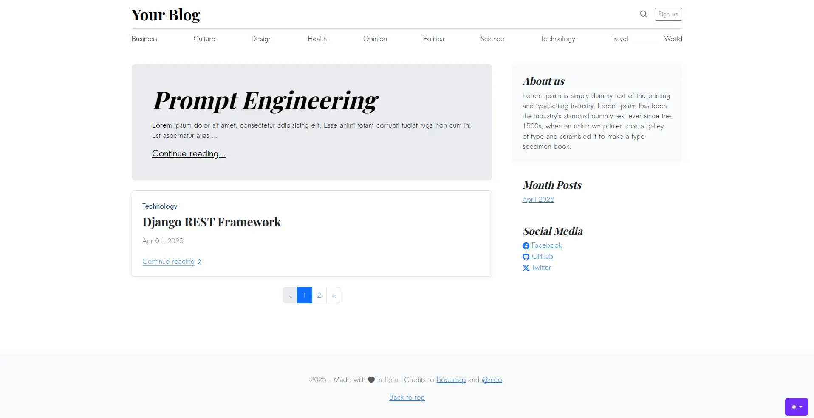
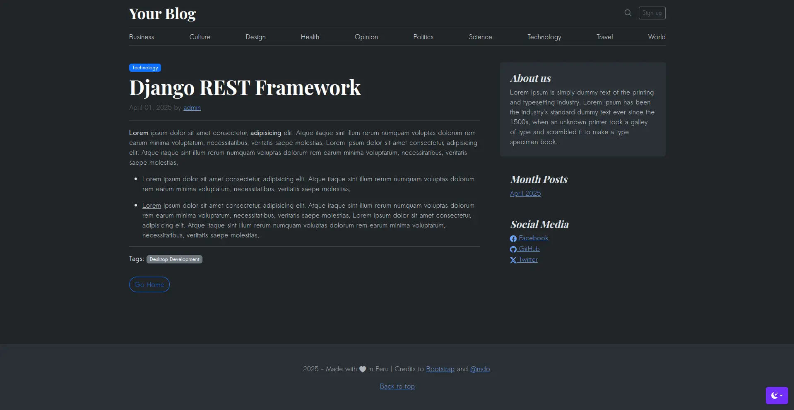

# Django Blog Application

This project is a feature-rich blog application built with Python and the Django web framework. It serves as a practical demonstration of core Django concepts and modern web development practices. The initial structure and features are inspired by [Código para Principiantes Tutorial](https://youtu.be/J2tuIm8pT5U?si=GAJJ1h-VNdyTFCzG).

This project showcases skills in backend development with Django, frontend integration using Bootstrap, and database management, reflecting my ongoing efforts to build a strong professional developer profile in Python.

## Features

### Implemented Features

- **Homepage:** Displays a paginated list of all published blog posts.
- **Post Detail View:** Provides the full content view for individual blog posts.
- **Content Filtering:** Allows users to browse published posts dynamically based on:
  - Category
  - Month and Year of publication
  - Author
- Dark & Light theme

### Planned Enhancements (Roadmap)

- **User Authentication:** Secure user registration, login, logout, and session management.
- **Search Functionality:** Enable site-wide search for blog posts based on title or content keywords.
- **Post Interaction:** Implement a 'Like' system for registered users.
- **Author Profiles:** Dedicated pages displaying details about content authors, leveraging Django's built-in `User` model.

## Key Django Concepts Utilized

This project leverages several important Django features and third-party packages:

- **Context Processors:** Efficiently inject common data (e.g., category lists, archives) into the context of all templates, reducing code repetition.
- **Paginator:** Implemented to manage large lists of posts by splitting them into digestible pages for better user experience and performance.
- **[django-prose-editor](https://pypi.org/project/django-prose-editor/):** Integrated to provide a user-friendly rich text editor for creating and editing blog post content.

## Technology Stack

- **Backend:** Python 3.12, Django 5.1
- **Database:** SQLite (Default for development/demonstration)
- **Frontend:** HTML5, CSS3, JavaScript
- **UI Framework & Icons:**
  - [Bootstrap 5.3](https://getbootstrap.com/)
  - [Bootstrap Icons](https://icons.getbootstrap.com/)
- **Base Template:** Inspired by the [Bootstrap Blog Example](https://getbootstrap.com/docs/5.3/examples/blog/)
- **Theme Handling:** Utilizes JavaScript for theme switching (e.g., Light/Dark modes) based on [Bootstrap Color Modes Example](https://github.com/twbs/examples/blob/main/color-modes/js/color-modes.js)
